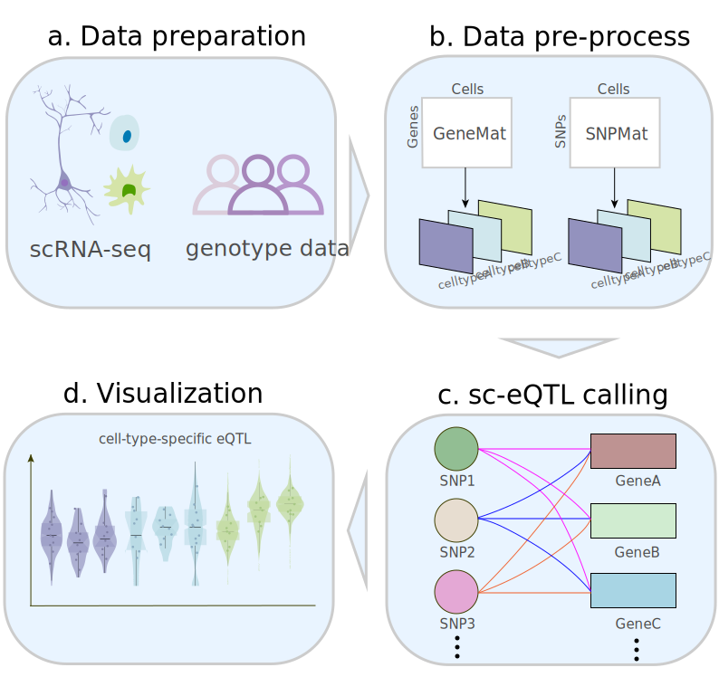

# Introduction
Expression quantitative trait loci (eQTL) analysis links variations in 
gene expression levels to genotypes. This package attempts to identify genetic
variants that affect the expression of genes at a single-cell level, and can 
also do cis-eQTL analysis, visualize the results. 

## Citation

If you find this tool useful, please cite:

------------------------------------------------------------------------

***[https://bioconductor.org/packages/3.18/scQTLtools](https://bioconductor.org/packages/3.18/scQTLtools)***

------------------------------------------------------------------------

------------------------------------------------------------------------

***[https://github.com/XFWu/scQTLtools](https://github.com/XFWu/scQTLtools)***

------------------------------------------------------------------------

# Installation

```{r, eval = FALSE}
if (!require("BiocManager"))
    install.packages("BiocManager")
BiocManager::install("scQTLtools")
```


# Overview of the package

scQTLtools functions can be categorized into mainly single-cell eQTL analysis 
and Visualization modules. Each of these functions and a short description is 
summarized as shown below.


{width=90%}


# Required input files
The input file requires genotype data, as well as either a gene expression 
matrix or a SeuratObject.

- gene expression matrix: describes gene expressions, the row names represent
gene IDs or SYMBOL and the column names represent cell IDs.
- SeuratObject: a Seurat object, `yourseurat@assays$RNA@data` is the gene 
expression matrix after normalizing.
- genotype matrix: A genotype matrix where each row is one variant and each 
column is one sample, and the scoring method is 0/1/2/3, 0 represents missing
values, 1 represents ref/ref, 2 represents alt/alt, and 3 represents ref/alt.

The columns of the genotype matrix should correspond to the columns of the gene
expression matrix.

**Example**

```{r input, message=FALSE}
library(scQTLtools)
# gene expression matrix
data(testGene)
# SeuratObject
data(testSeurat)
# load the genotype data
data(testSNP)
data(testSNP2)
```


# Create eqtl object
The createQTLObject class is an R object designed to store data related to eQTL
analysis, encompassing data lists, result data frames, and slots for 
biClassify, species, and group information.

**Example**

```{r createObject_matrix, message=FALSE}
eqtl_matrix <- createQTLObject(
    snpMatrix = testSNP,
    genedata = testGene,
    biClassify = FALSE,
    species = 'human',
    group = NULL)
```

Users can set biClassify to TRUE to change the genotype coding method.

**Example**

```{r createObject_matrix_bi, message=FALSE}
eqtl_matrix_bi <- createQTLObject(
    snpMatrix = testSNP,
    genedata = testGene,
    biClassify = TRUE,
    species = 'human',
    group = NULL)
```

Users can use Seuratobjct instead of gene expression matrix. 

**Example**

```{r createObject_seuratobject, message=FALSE}
eqtl_seurat <- createQTLObject(
    snpMatrix = testSNP2,
    genedata = testSeurat,
    biClassify = FALSE,
    species = 'human',
    group = "celltype")
```


# Normalize gene expression matrix
Use `normalizeGene()` to normalize the gene expression matrix.

**Example**

```{r Normalize_matrix, message=FALSE}
eqtl_matrix  <- normalizeGene(
    eQTLObject = eqtl_matrix, 
    method = "logNormalize")
```


# Identify the valid gene snp pairs
Here we use `filterGeneSNP()` to filter snp gene pairs.

**Example**

```{r filter_matrix, message=FALSE}
eqtl_matrix <- filterGeneSNP(
    eQTLObject = eqtl_matrix,
    snpNumOfCellsPercent = 2,
    expressionMin = 0,
    expressionNumOfCellsPercent = 2)
```

```{r filter_seuratobject, message=FALSE}
eqtl_seurat <- filterGeneSNP(
    eQTLObject = eqtl_seurat,
    snpNumOfCellsPercent = 2,
    expressionMin = 0,
    expressionNumOfCellsPercent = 2)
```


# Call single cell eQTL
Here we use `callQTL()` to do single cell eQTL analysis.

**Example**

```{r callQTL1_matrix, message=FALSE}
eqtl1_matrix <- callQTL(
    eQTLObject = eqtl_matrix,
    gene_ids = NULL,
    downstream = NULL,
    upstream = NULL,
    pAdjustMethod = "bonferroni",
    useModel = "poisson",
    pAdjustThreshold = 0.05,
    logfcThreshold = 0.1)
```

```{r callQTL1_seuratobject, message=FALSE}
eqtl1_seurat <- callQTL(
    eQTLObject = eqtl_seurat,
    gene_ids = NULL,
    downstream = NULL,
    upstream = NULL,
    pAdjustMethod = "bonferroni",
    useModel = "linear",
    pAdjustThreshold = 0.05,
    logfcThreshold = 0.025)
```

Users can use the parameter `gene_ids` to select one or several genes of 
interest for identifying sc-eQTLs.

**Example**

```{r callQTL2_matrix, message=FALSE}
eqtl2_matrix <- callQTL(
    eQTLObject = eqtl_matrix,
    gene_ids = c("CNN2", 
                "RNF113A", 
                "SH3GL1", 
                "INTS13", 
                "PLAU"),
    downstream = NULL,
    upstream = NULL,
    pAdjustMethod = "bonferroni",
    useModel = "poisson",
    pAdjustThreshold = 0.05,
    logfcThreshold = 0.1)
```

Users can also use `upstream` and `downstream` to specify SNPs proximal to the
gene in the genome.

**Example**

```{r callQTL3_matrix, message=FALSE} 
eqtl3_matrix <- callQTL(
    eQTLObject = eqtl_matrix,
    gene_ids = NULL,
    downstream = -9e7,
    upstream = 2e8,
    pAdjustMethod = "bonferroni",
    useModel = "poisson",
    pAdjustThreshold = 0.05,
    logfcThreshold = 0.05)
```


# Visualize the result.
Here we use `visualizeQTL()` to visualize the result. There are four types of
plots available to visualize sc-eQTL results. Users can choose "histplot",
"violin", "boxplot", or "QTLplot". 

**Example**

```{r visualizeQTL_matrix, message=FALSE}
visualizeQTL(
    eQTLObject = eqtl1_matrix,
    SNPid = "1:632647",
    Geneid = "RPS27",
    groupName = NULL,
    plottype = "QTLplot",
    removeoutlier = TRUE)
```

```{r visualizeQTL_seuratobject, message=FALSE}
visualizeQTL(
    eQTLObject = eqtl1_seurat,
    SNPid = "1:632647",
    Geneid = "RPS27",
    groupName = NULL,
    plottype = "QTLplot",
    removeoutlier = TRUE)
```

In addition, the parameter `groupName` is used to specify a particular
single-cell group of interest.

```{r visualizeQTL_seuratobject_groupName, message=FALSE}
visualizeQTL(
    eQTLObject = eqtl1_seurat,
    SNPid = "1:632647",
    Geneid = "RPS27",
    groupName = "GMP",
    plottype = "QTLplot",
    removeoutlier = TRUE)
```


# References
1. Miao, Z., Deng, K.e., Wang, X., Zhang, X., Berger, B., 2018. DEsingle for
detecting three types of differential expression in single-cell RNA-seq data.
Bioinformatics 34 (18), 3223–3224.
<https://doi.org/10.1093/bioinformatics/bty332>
2. Hu, Y., Xi, X., Yang, Q., Zhang, X., 2020. SCeQTL: An R package for
identifying eQTL from single-cell parallel sequencing data. BMC Bioinformatics
21, 1–12. <https://doi.org/10.1186/s12859-020-3534-6>
3. Nathan, A., Asgari, S., Ishigaki, K. et al. Single-cell eQTL models reveal
dynamic T cell state dependence of disease loci. Nature 606, 120–128 (2022).
<https://doi.org/10.1038/s41586-022-04713-1>
4. Ma, T. ,  Li, H. , &  Zhang, X. . (2021). Discovering single-cell eQTLs from
scRNA-seq data only. Cold Spring Harbor Laboratory.
5. Schmiedel, B. J., Gonzalez-Colin, C., Fajardo, V., Rocha, J., Madrigal, A.,
Ramírez-Suástegui, C., Bhattacharyya, S., Simon, H., Greenbaum, J. A., Peters,
B., Seumois, G., Ay, F., Chandra, V., & Vijayanand, P. (2022). Single-cell eQTL
analysis of activated T cell subsets reveals activation and cell type-dependent
effects of disease-risk variants. Science immunology, 7(68), eabm2508.
<https://doi.org/10.1126/sciimmunol.abm2508>


# Session Info

```{r}
sessionInfo()
```

